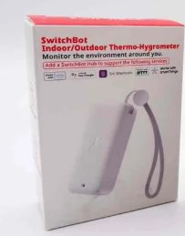

# SwitchBotMeter
Read SwitchBot Thermometer Hygrometer with Micropython without cloud or hub or app.

## SwitchBot Meter (classic)

[Link to Amazon](https://www.amazon.de/gp/product/B08GYKLWVR)

[Link to Manufacturer](https://eu.switch-bot.com/pages/switchbot-meter)

## SwitchBot Indoor/Outdoor Thermo-Hygrometer

[Link to Amazon](https://www.amazon.de/gp/product/B0BVLYPYT1)

[Link to Manufacturer](https://eu.switch-bot.com/products/switchbot-indoor-outdoor-thermo-hygrometer)

## Microcontrollers

was tested with Raspberry-Pico W

and ESP32 Node MCU

and Micropython V 1.25.0

