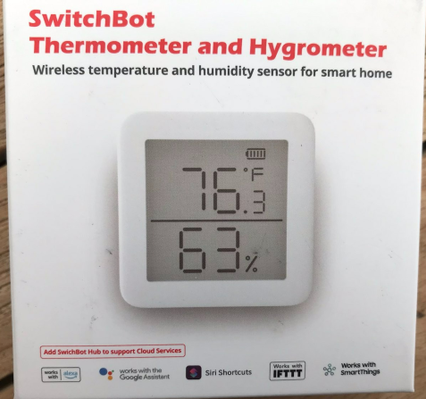
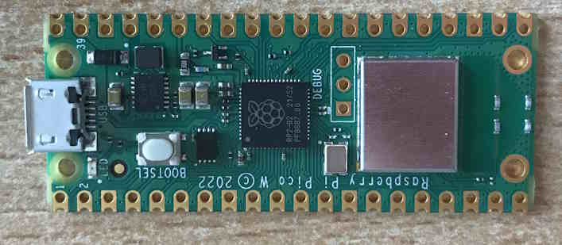
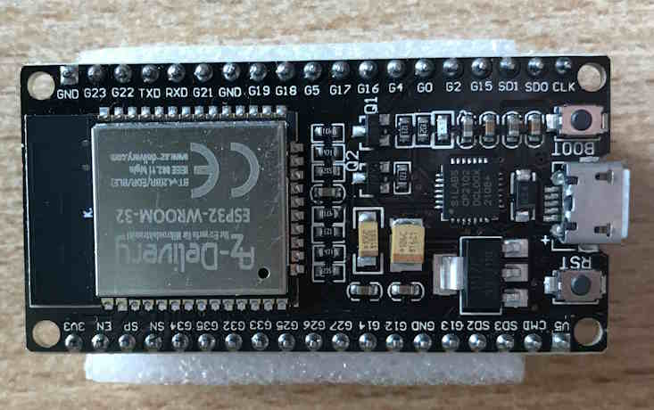

# SwitchBotMeter
Read SwitchBot Thermometer Hygrometer Indoor with Micropython without cloud or hub or app.

## Devices

[Link to Amazon](https://www.amazon.de/gp/product/B08GYKLWVR)

[Link to Manufacturer](https://eu.switch-bot.com/pages/switchbot-meter)

was tested with Raspberry-Pico W

and ESP32 Node MCU

